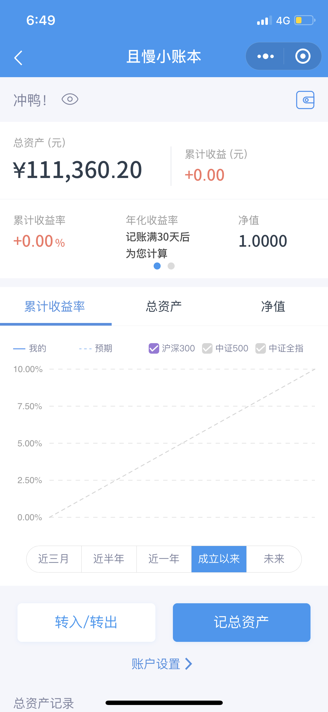

# 未选择的路

> 一片树林里分出两条路，而我选择了人迹更少的一条，从此决定了我一生的道路。

2020，你好。

本周开始将对我的投资进行记录，希望今年的我能有点小小的不同吧。

## 我为什么要投资

为了更好的生活。我希望我的未来能多一些确定性，不用为了金钱而忙碌工作，能够做一些自己喜欢的事。

## 我的投资计划

以指数基金和一些优秀的主动基金为长期仓位，辅以网格交易、二八轮动以及可转债打新等策略。因本人投资资历尚浅，还未完善自己的投资体系，仍处于不断学习中。目前指数基金投资跟投E大的长赢指数投资计划，主动基金投资跟投刚哥的九雾组合。

## 最新净值

本周第一次记录，净值为1.0000。

 

