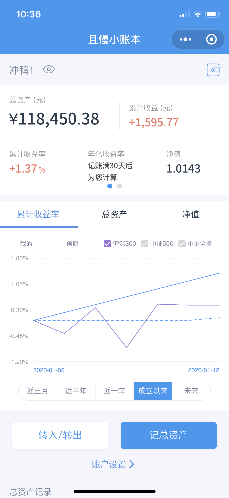

# 人生足别离
> 花发多风雨，人生足别离。

这周一个我很尊敬的S学姐离职了。

虽然早已能够预料到，但是事情真正发生的时候还是感觉有点突然。她总是对生活充满了热情，不断探索新的可能，似乎从来都没有什么困难能把她打倒。而我一直是一个胆小的人，害怕失败，不敢去尝试。我非常羡慕她的生活态度。

成年人的世界离别是悄无声息的，有很多人来不及告别。我不是个善于言辞的人，临别，我总觉得该说几句什么，话到嘴边却成了一句加油。我想，这句话既是对她说的，也是对我自己说的，我也要成为一个更好的人啊。

有缘再见。

## 本周操作
- 买入广发中债7-10年期国开行债券指数A 1000元
- 买入广发纯债债券A 1000元
- 买入大摩强收益债券 200元
- 卖出建信现金增利货币 701.41元
- 卖出富国信用债债券C 1005.77元
- 充值现金宝 3001.59元
- 跟投九雾组合发车 1000元
- 中签希望发债 1000元

## 最新净值

最新的资产是**118450.38**，基金净值是**1.0143**，本周增长**+1.37%**。

 