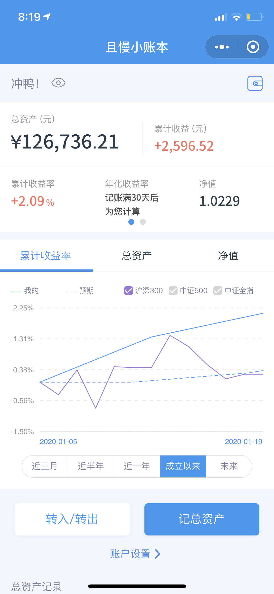

# 能力圈
> 你永远赚不到超出你认知范围之外的钱，除非你靠运气，但是靠运气赚到的钱，最后往往又会靠实力亏掉，这是一种必然。

知乎上有一个问题：“大三的学生，手头有6000元的钱，想要做些小投资赚点儿钱，有什么好建议？”

“买比特币，保存好钱包文件，然后忘掉你有过6000元这回事。五年后再看看。”

这是一条来自2011年的回答，我在2018年的时候看到了这条回答，题主当时如果听从了这条建议，现在资产应该有几千万了。我在震惊的同时，开始研究起了数字货币，一段时间后，怀揣着暴富的想法开始了我的投资之路，这也是我第一次进行投资。

区块链，多么美妙的技术，BTC就是数字黄金。错过了BTC，我不能再错过EOS。在试探性的一波投入之后，EOS开始了上涨，我的信心得到了增强，加大了投入。随着收益达到了50%，我发现我拿不住了，毕竟没有到口袋的钱只是一个数字，我怂怂地套了现，并打算只用赚来的钱进行投资。到这为止，一切都好。时间来到了6月，临近世界杯，各种题材币百花齐放。我怀着投机的想法进行了买入，哪知买在了高点。屋漏偏逢连夜雨，BTC此时也开始下跌，当跌到8000的时候我忍不住加了仓。继续下跌，跌到6000，我以为已经是大底，满仓投入。事实证明我还是太年轻，随后比特大陆与澳本聪开战，BCH分叉，BTC跌到了3000多。EOS更是惨不忍睹，我的亏损达到了90%。我感到了前所未有的绝望，工作两年大部分积蓄都亏了进去，虽然也没多少钱因为我存不下来钱，我在心里对自己说以后再也不碰这个东西了。

我渐渐意识到投资光靠感觉是不行的，得建立自己的投资体系。我开始阅读一些投资书籍，慢慢了解到能力圈的存在。能力圈是什么呢？能力圈是一个范围，你在这个范围之内进行投资，你将有更大的概率能赚到钱。而一旦超出这个范围，你的投资就像掷硬币一样，只能靠运气。那么我现在应该做的是什么呢？找到自己的能力圈，慢慢建立自己的投资体系，等投资体系成熟了，便严格遵守，不轻易改变。数字货币对于我来说风险性太高，背后盈利模式不清晰，不易掌握，指数基金+定投+分散投资才能让我在这个市场上做大概率对的事情，慢慢变富。

## 本周操作
- 充值余额宝 1000元
- 买入长江养老月安享 1000元（🧧12.88元）
- 买入天弘弘择短债债券C 500元 (🧧5.49元)
- 买入天弘弘择短债债券C 500元 (🧧5.37元)
- 买入收益挑战 300 元
- 买入广发中证全指金融地产ETF联接A 1000元
- 卖出天弘弘择短债债券C 1004.06元
- 跟投九雾组合发车 1000元
- 充值天天宝 4000元
- 买入保利地产 1608元
- 卖出N日月转 1259.75元
- 卖出N建工转 1126.77元
- 卖出深南转债 1275.24元
- 卖出新天转债 1117.78元

## 最新净值

最新的资产是**126736.21**，基金净值是**1.0229**，本周增长**+0.72%**。

 