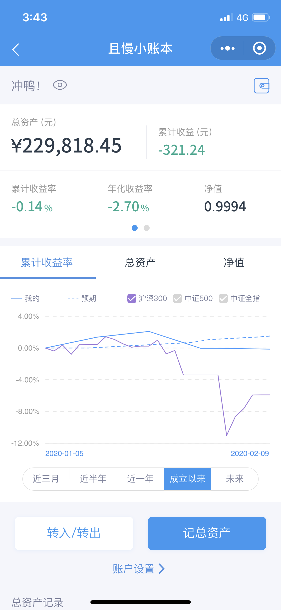

# 特殊的一周
春节之后第一天开盘，受到疫情的影响，上证指数跌幅将近8%，下跌是大家都能预料到的，但这跌幅把我跌懵了。在我预想中，应该是跌5%左右，出于对继续下跌的担忧，我只谨慎的加了1/10的仓位。随后四天，A股相对缓慢的连续上涨，十分出人意料，我又慢慢地补了一些仓位。

犹豫就会败北。现在回顾来看，确实有一些值得反思的地方，比如说第一天加的仓位比例太少。每个人都想加在市场的底部，我也不例外，然而，你永远无法预测市场，只能追求一种模糊的正确。什么是模糊的正确呢？比如说A股在3000点以下是处于一个比较便宜的位置。第一天下跌之后已经到达了很便宜的位置，我却仍不知足，实属弟弟行为。下次机会到来的时候，我应该更果断一点。

A股是个大幅波动的市场，除了长期仓位之外，我觉得应该要加大波段仓位的投入，不能白坐一轮又一轮的过山车。网格交易还不太会做，看来得抓紧学习，投资是一个不断学习的过程。

## 本周操作
- 充值 100000元
- 买入华夏恒生ETF联接（QDII）A 3000元
- 买入富国沪深300 1000元
- 买入华夏上证50ETF联接A 3000元
- 买入华夏中证500ETF联接A 1000元
- 买入富国中证红利指数增强 3000元
- 买入华安标普全球石油（QDII-LOF）1000元
- 买入兴全可转债混合 1000元
- 跟随九雾组合发车 1000元
- 买入万科A 300股
- 买入保利地产 400股
- 买入招商银行 300股
- 卖出汽模转2 10张
- 卖出希望转债 10张

## 最新净值

最新的资产是**229818.45**，基金净值是**0.9994**，本周增长**-0.1%**。

 