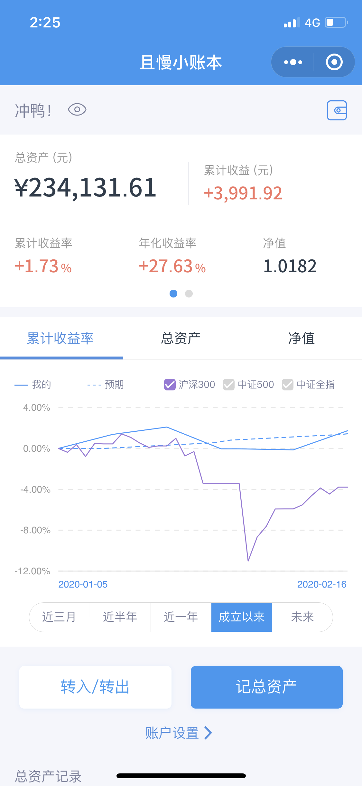

# 混沌
keep calm and carry on.

## 本周操作
- 买入招商中证白酒指数分级 1000元
- 买入广发中证全指金融地产ETF联接A 1000元
- 卖出天弘弘择短债债券C 2014.75元
- 卖出大摩强收益债券 1010.89元
- 买入华宝油气 7000元 （6000元用来尝试套利）
- 买入中国平安 200股
- 跟随九雾组合发车 1000元
- 卖出我要稳稳的幸福 2060.56元

## 最新净值

最新的资产是**231431.61**，基金净值是**1.0065**，本周增长**+0.7%**。

 